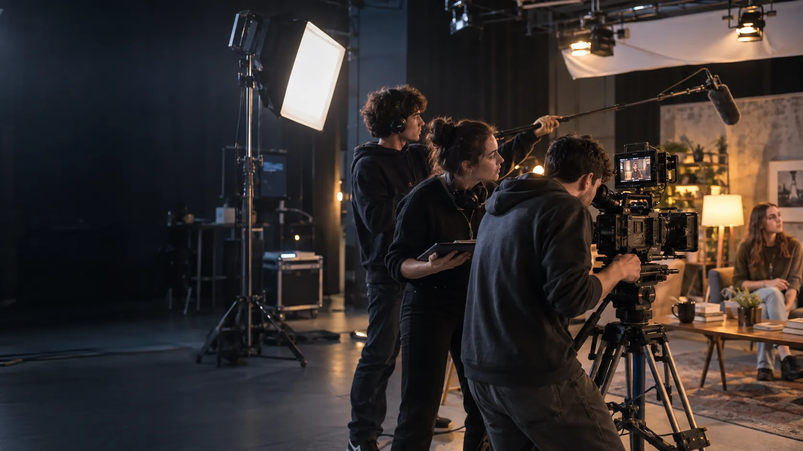

# Grado en Comunicación Audiovisual

## Ficha

- **Área:** Artes y Humanidades
- **Tipo:** Grado
- **Duración:** 4 años
- **Créditos (ECTS):** 240
- **Destacado en portada:** No

## Descripción corta

Cuenta historias en cualquier pantalla.

## Imagen de cabecera

Texto alternativo: Equipo de estudiantes grabando en el plató de la universidad.

## Sobre el estudio

El Grado en Comunicación Audiovisual te forma para idear, producir y distribuir contenidos para cine, televisión, plataformas y redes sociales.

Tendrás acceso desde el primer curso a nuestro plató y estudio de grabación, y participarás en producciones reales que se emiten en la televisión universitaria.

## Qué aprenderás

- Guion y narrativa audiovisual
- Dirección y realización
- Montaje y postproducción
- Sonido y música para la imagen
- Estrategia de contenidos para plataformas

## Temario

[Descargar temario (PDF)](../assets/temario-grado-en-comunicacion-audiovisual.pdf)
